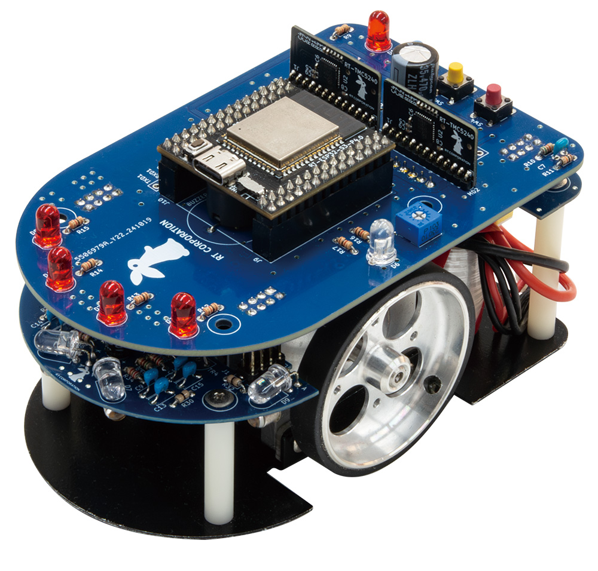

# pico_classic_v4_stm32_arduino_examples

## 動作環境
- Arduino IDE v2.3.5
- Arduino STM32 MCU based boardsESP32 v2.10.1

## サンプルプログラムについて
### STEP1 〜 STEP8

- Pi:Co Classic4のハードウェアを動かすための、Arduinoスケッチの書き方をまとめています

## スケッチファイルの自動整形について
- ソースコードのレイアウトを整えるため、各スケッチファイルにはArduino IDEの自動整形を適用しています。 自動整形のルールは[.clang-format](.clang-format) ファイルを参照してください。

## License

(C) 2025 RT Corporation

各ファイルはライセンスがファイル中に明記されている場合、そのライセンスに従います。特に明記されていない場合は、Apache License, Version 2.0に基づき公開されています。  
ライセンスの全文は[LICENSE](./LICENSE)または[https://www.apache.org/licenses/LICENSE-2.0](https://www.apache.org/licenses/LICENSE-2.0)から確認できます。

※このソフトウェアは基本的にオープンソースソフトウェアとして「AS IS」（現状有姿のまま）で提供しています。本ソフトウェアに関する無償サポートはありません。  
バグの修正や誤字脱字の修正に関するリクエストは常に受け付けていますが、それ以外の機能追加等のリクエストについては社内のガイドラインを優先します。
